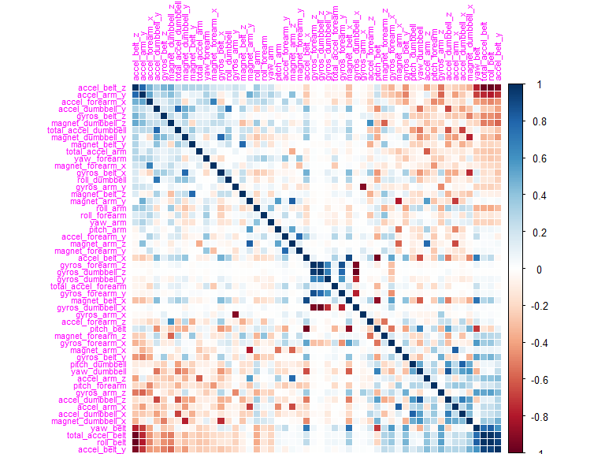
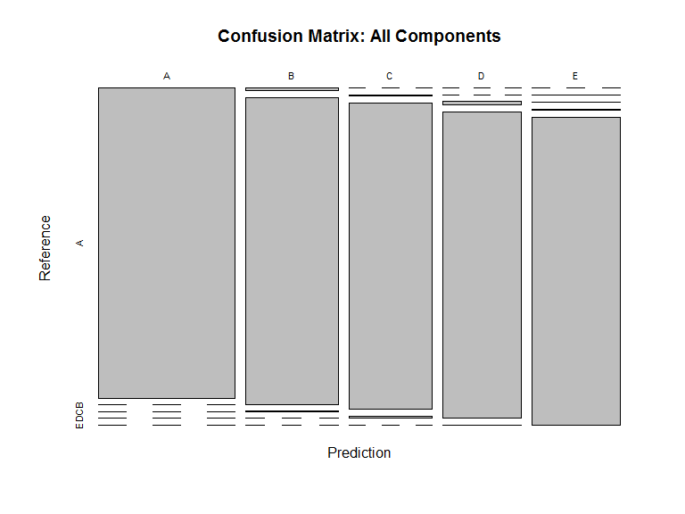
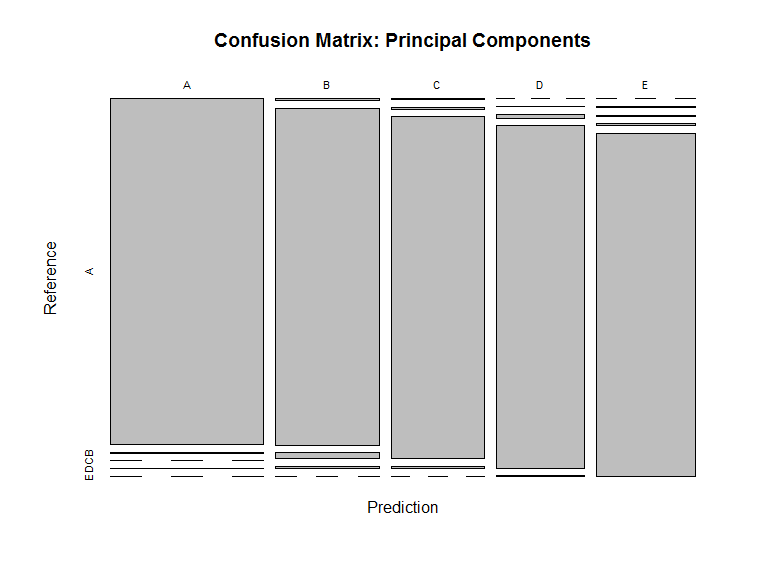

# Practical Machine Learning - Build, Train, Test model assignment
sv  
Sunday, November 16, 2014  
opts_chunk$set(echo=TRUE, results='asis')
# Desc:
# The purpose of this project is to demonstrate ability to clean data, pre-process data, build a predictive model, cross
# validate the model and ultimately test the model with provided test data set.
#
# Background: Using devices such as Jawbone Up, Nike FuelBand, and Fitbit it is now possible to collect a large amount of 
# data about personal activity relatively inexpensively. These type of devices are part of the quantified self movement - 
# a group of enthusiasts who take measurements about themselves regularly to improve their health, to find patterns in their 
# behavior, or because they are tech geeks. One thing that people regularly do is quantify how much of a particular activity 
# they do, but they rarely quantify how well they do it. 
#
# The goal of the project is to predict the manner in which participants did the exercise.
#
# More information is available from the website here: 
# http://groupware.les.inf.puc-rio.br/har (see the section on the Weight Lifting Exercise Dataset). 
#
# The training data for this project are available here: 
# https://d396qusza40orc.cloudfront.net/predmachlearn/pml-training.csv
# The test data are available here: 
# https://d396qusza40orc.cloudfront.net/predmachlearn/pml-testing.csv

# Get libraries needed for the analysis/model building and testing. Fix the seed value in random function to maintain reproducibility


```r
library(caret) 
```

```
## Loading required package: lattice
## Loading required package: ggplot2
```

```r
library(corrplot)
library(kernlab) 
library(randomForest) 
```

```
## randomForest 4.6-10
## Type rfNews() to see new features/changes/bug fixes.
```

```r
set.seed(1116)
```
# Let's get the data. Let's remove null columns and unnecessary columns for the model e.g. names and dates etc.
# Essentially let's create tidy sets - one for the training set and another for the test set
# read the csv file for training  

```r
data_training <- read.csv("pml-training.csv", skip = 0, comment.char = "", check.names = TRUE, ,na.strings= c("NA","NaN",""," "))
dim(data_training)
```

```
## [1] 19622   160
```
# create the tidy training data set 

```r
isNA <- apply(data_training, 2, function(x) { sum(is.na(x)) })
tidyData <- subset(data_training[, which(isNA == 0)],select=-c(X, user_name, new_window, num_window, raw_timestamp_part_1, raw_timestamp_part_2, cvtd_timestamp))
dim(tidyData)
```

```
## [1] 19622    53
```
# read the csv file for testing

```r
data_test <- read.csv("pml-testing.csv", skip = 0, comment.char = "", check.names = TRUE, ,na.strings= c("NA","NaN",""," "))
```
# create the tidy testing data set  

```r
isNA_testing <- apply(data_test, 2, function(x) { sum(is.na(x)) })
tidyDatatest <- subset(data_test[, which(isNA_testing == 0)],select=-c(X, user_name, new_window, num_window, raw_timestamp_part_1, raw_timestamp_part_2, cvtd_timestamp))
dim(tidyDatatest)
```

```
## [1] 20 53
```
# Instead of using the entire training data set for training only, lets split the set into 70% training and 30% cross validation

```r
 inTrain <- createDataPartition(y = tidyData$classe, p = 0.7, list = F) 
 training <- tidyData[inTrain, ] 
 crossval <- tidyData[-inTrain, ] 
```
# plot a correlation matrix 

```r
corrplot(cor(training[, -length(training)]), order = "FPC", method = "color", type = "full", tl.cex = 0.7,  tl.col = rgb(1, 0, 1)) 
```

 
# Now using RandomForest Model for classification and regression, let's train our model. We will use train function for tuning RandomForest routine. It is highly time and resource consuming operation. We will apply the model to the cross validation data that we have set aside.

```r
ctrl <- trainControl(allowParallel=T, method="cv", number=4)
model <- train(classe ~ ., data=training, model="rf", trControl=ctrl)
predcrossval <- predict(model, newdata=crossval)
```
# Let's review how good our predictions have been.

```r
confusionMatrix(crossval$classe, predcrossval) 
```

```
## Confusion Matrix and Statistics
## 
##           Reference
## Prediction    A    B    C    D    E
##          A 1674    0    0    0    0
##          B    9 1128    2    0    0
##          C    0    5 1013    8    0
##          D    0    0   11  952    1
##          E    0    1    1    5 1075
## 
## Overall Statistics
##                                           
##                Accuracy : 0.9927          
##                  95% CI : (0.9902, 0.9947)
##     No Information Rate : 0.286           
##     P-Value [Acc > NIR] : < 2.2e-16       
##                                           
##                   Kappa : 0.9908          
##  Mcnemar's Test P-Value : NA              
## 
## Statistics by Class:
## 
##                      Class: A Class: B Class: C Class: D Class: E
## Sensitivity            0.9947   0.9947   0.9864   0.9865   0.9991
## Specificity            1.0000   0.9977   0.9973   0.9976   0.9985
## Pos Pred Value         1.0000   0.9903   0.9873   0.9876   0.9935
## Neg Pred Value         0.9979   0.9987   0.9971   0.9974   0.9998
## Prevalence             0.2860   0.1927   0.1745   0.1640   0.1828
## Detection Rate         0.2845   0.1917   0.1721   0.1618   0.1827
## Detection Prevalence   0.2845   0.1935   0.1743   0.1638   0.1839
## Balanced Accuracy      0.9973   0.9962   0.9918   0.9920   0.9988
```

```r
AllComp <- confusionMatrix(crossval$classe, predcrossval) 
plot(AllComp[[2]], main="Confusion Matrix: All Components")
```

 

# Our model is 99.2% correct. Out of Sample errors are low as the accuracy of the model is quite high with 0.9927. Let's see which variables are the most critical i.e. Principal Components. We want to see if we can reduce the Out of Sample errors and increase the accuracy as well as efficiency of the model by reducing number of components.


```r
varImp(model)
```

```
## rf variable importance
## 
##   only 20 most important variables shown (out of 52)
## 
##                      Overall
## roll_belt             100.00
## pitch_forearm          57.24
## yaw_belt               51.41
## pitch_belt             43.48
## magnet_dumbbell_z      42.12
## magnet_dumbbell_y      41.59
## roll_forearm           40.28
## accel_dumbbell_y       21.83
## roll_dumbbell          16.39
## accel_forearm_x        15.95
## magnet_dumbbell_x      15.30
## magnet_belt_z          14.11
## accel_dumbbell_z       13.12
## accel_belt_z           12.98
## total_accel_dumbbell   12.95
## magnet_forearm_z       12.87
## magnet_belt_y          11.73
## gyros_belt_z           10.99
## magnet_belt_x          10.68
## yaw_arm                10.02
```
# Out of 53 variables only 20 some variables are of any significance.
# Let's now try to restricts the application of the model to the 10 most important variables (principal components)

```r
tidyerdata <- subset(tidyData, 
                    select=c(roll_belt, pitch_forearm, yaw_belt, pitch_belt, magnet_dumbbell_z, magnet_dumbbell_y, roll_forearm, accel_dumbbell_y, magnet_dumbbell_x, roll_dumbbell, classe))
newmodel <- train(classe ~ ., data=tidyerdata[inTrain,], model="rf", trControl=ctrl)
```
# Let's review if we are any better off !

```r
predcrossvalnew <- predict(newmodel, newdata=crossval)
confusionMatrix(crossval$classe, predcrossvalnew) 
```

```
## Confusion Matrix and Statistics
## 
##           Reference
## Prediction    A    B    C    D    E
##          A 1666    6    0    2    0
##          B    6 1105   20    8    0
##          C    3    6 1009    8    0
##          D    0    1   11  950    2
##          E    0    5    2    7 1068
## 
## Overall Statistics
##                                           
##                Accuracy : 0.9852          
##                  95% CI : (0.9818, 0.9881)
##     No Information Rate : 0.2846          
##     P-Value [Acc > NIR] : < 2.2e-16       
##                                           
##                   Kappa : 0.9813          
##  Mcnemar's Test P-Value : NA              
## 
## Statistics by Class:
## 
##                      Class: A Class: B Class: C Class: D Class: E
## Sensitivity            0.9946   0.9840   0.9683   0.9744   0.9981
## Specificity            0.9981   0.9929   0.9965   0.9971   0.9971
## Pos Pred Value         0.9952   0.9701   0.9834   0.9855   0.9871
## Neg Pred Value         0.9979   0.9962   0.9932   0.9949   0.9996
## Prevalence             0.2846   0.1908   0.1771   0.1657   0.1818
## Detection Rate         0.2831   0.1878   0.1715   0.1614   0.1815
## Detection Prevalence   0.2845   0.1935   0.1743   0.1638   0.1839
## Balanced Accuracy      0.9964   0.9884   0.9824   0.9858   0.9976
```

```r
PrComp <- confusionMatrix(crossval$classe, predcrossvalnew) 
plot(PrComp[[2]], main="Confusion Matrix: Principal Components")
```

 
# Our newmodel is 98.5% correct as compared to previous one. This model ran faster/efficiently. However estimated out-of-sample error has gone up as compared to when we had all the components and not just the principal. We can observer this as the accuracy has reduced.So we will not use the newer model but will stay with the original model for test data.

# Having the validation set and process of validating and checking helps us to tune the model and reduce out of sample errors. In this case we did not need to tune any further.

```r
predictTest <- predict(model, tidyDatatest) 
predictTest
```

```
##  [1] B A B A A E D B A A B C B A E E A B B B
## Levels: A B C D E
```
